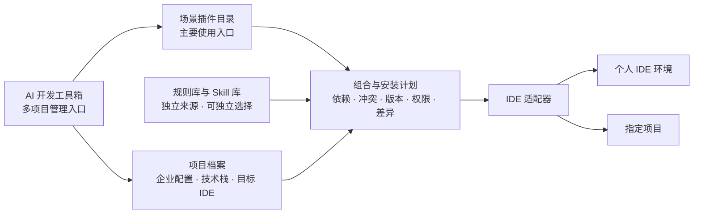

# AI 开发工具箱：产品定位与架构

本文把已确认的产品方向、建议采用的架构和当前实现分开描述；目标能力不代表已经交付。

## 一句话定位

**AI 开发工具箱是独立于任何 AI 编程 IDE 的多项目管理产品。**用户安装一次工具箱，管理多个项目及多个目标 IDE；工具箱维护规则、Skills 和能力插件，通过 IDE 适配器将选定内容安装到个人 IDE 环境或指定项目。

它不等于 Codex、Cursor、TraeCode 或 Qoder 的某一个插件，也不等于一套通用规则。宿主 IDE 中出现的插件包只是工具箱的一种交付产物。

**产品方向是以场景插件作为用户主要入口。**用户通常先选择“我要完成哪类工作”，再由工具箱组合所需 Skills、工具连接和当前项目规则。插件优先是本产品的设计选择；不能仅凭别家提供插件市场就断言插件的实际使用量高于 Skills。

## 产品的四块结构

| 组成 | 回答的问题 | 权威来源与边界 |
| --- | --- | --- |
| 规则库 | 当前企业和项目要求 AI 遵守什么？ | 通用基线、企业要求、项目事实和本地覆盖按适用范围组合。规则正文只维护一份；生成给 IDE 的文件是安装产物。 |
| Skill 库 | 某类任务按什么步骤完成？ | 维护可复用的任务流程与依赖声明。通用 Skill 在运行时读取当前有效规则，不写死某家企业的要求。 |
| 能力插件库 | 用户要完成哪类开发工作？ | 作为主要可发现、可安装入口，维护场景能力、依赖、权限和版本。一个插件可组合多个 Skills 和工具连接，但不因此成为企业规则的第二份来源。 |
| IDE 适配器 | 这些内容怎样在目标 IDE 中安装和生效？ | 分别处理格式、路径、命名、宿主权限、调用方式和验证。适配器可能生成 IDE 插件包，但 IDE 插件包不等于工具箱本身或能力插件库。 |

工具箱应用或 CLI 是以上四块的**管理入口**：负责项目列表、资产选择、安装计划、差异审查、状态记录、更新和卸载。它不是第五类开发资产。

### 两种容易混淆的“插件”

- **工具箱的能力插件**：产品目录中的一项可选能力，例如将来用于代码托管或设计协作的能力。
- **目标 IDE 的插件包**：Codex、Qoder 等宿主用于安装内容的格式。它可以装入某项能力插件及其 Skills、工具或规则入口，也可以只是工具箱的管理入口。

现有 `plugins/agent-rule-kit/` 属于第二种，是 Codex 交付包。把它显示或宣传为整款“AI 开发工具箱”会让用户误以为安装这一个包就获得了全部产品能力，应调整命名和安装说明。

## 插件优先的使用方式

工具箱可提供面向项目阶段或技术领域的插件。以下是拟议的产品目录，不代表已经实现：

| 场景插件 | 用户要完成的工作 | 可组合的内容与交接结果 |
| --- | --- | --- |
| 产品经理／产品规划 | 梳理需求、范围、验收标准和优先级 | 需求分析等 Skills；输出可供设计和开发使用的需求说明、任务清单。 |
| UI 设计 | 设计信息结构、页面流程、界面和交互 | 设计 Skills、素材或设计工具连接；输出设计稿、交互说明与交付规格。 |
| 前端开发 | 实现页面、组件、状态和接口对接 | 前端 Skills、测试与浏览器工具；输出代码、测试和验收记录。 |
| 后端开发 | 设计并实现接口、数据和服务 | 后端 Skills、接口与数据库工具；输出契约、实现、测试和迁移说明。 |
| Unity 开发 | 实现场景、交互、资源和构建验证 | Unity Skills、编辑器或构建工具；输出工程变更与实际验证记录。 |

这不是要求每个项目按表格从上到下安装一遍。工具箱根据项目类型选择插件并衔接产物：纯后端项目可跳过 UI；Unity 项目可能同时需要产品规划、UI 与 Unity 开发。项目流程可以表达“需求 → 设计 → 实现 → 验收”的交接，并允许跳过或并行阶段；不必做成一个包含所有岗位的巨型插件。

每个能力插件至少应声明：适用任务、输入与输出、包含或依赖的 Skills、需要的工具与授权、所读取的规则类别、支持的 IDE 和运行环境。单个 Skill 仍可独立安装；当插件已经包含它时，工具箱应避免重复安装。插件自带的执行安全约束可以保留，但企业和项目规则仍从规则库组合，不复制进每个插件维护。

参考事实：[Codex 插件可以包含 Skills、MCP 和 Hook](https://developers.openai.com/plugins/concepts/plugins)；[TraeCode 将插件定义为场景能力，部分插件包含 MCP Server 和 Skill](https://docs.trae.cn/ide_marketplace)。这些是宿主支持的能力形态，不是用户采用比例的数据。

## 多项目与安装范围

工具箱本身安装在用户环境中，管理多个项目。**多项目管理不意味着向所有项目注入同一套规则。**每个项目都有独立的技术栈、企业配置、规则版本、已选 Skills、能力插件和目标 IDE 状态。

安装时至少区分三件事：

1. **资产来源**：内容来自工具箱官方、企业、个人还是项目仓库。
2. **安装目标与范围**：送往哪个 IDE；在该 IDE 的个人环境、某个项目或企业托管范围生效。个人全局只表示该 IDE 中此用户的多个项目可用，不表示跨 IDE 通用，也不等同于管理员级的系统安装。
3. **运行位置与身份**：本机或云端执行；连接外部服务时使用哪个账号、哪些权限。安装成功不代表云端同步、外部授权和运行时依赖都已经满足。

建议界面以“选项目 → 选场景插件”为主流程，再展示“在这个 IDE 的多个项目使用”和“仅在选定项目使用”两个常用范围；适配器负责展示该宿主额外支持的团队、管理员、仅本机本项目等范围。插件带来的 Skill 与工具依赖应在安装计划中展开，规则范围单独审查；不能用一个总开关替三类资产做决定。企业强制要求与项目覆盖发生冲突时，先显示冲突并要求处理，不静默决定优先级。

## 安装与调用的关系

一次安装应按以下顺序进行：选择项目和 IDE → 选择场景插件或独立 Skill → 展开其依赖并选择规则与安装范围 → 检查冲突、已有文件和权限 → 展示将发生的变化 → 应用并验证 → 记录每个目标的版本及归属。更新和卸载也按目标分别预览和执行，不覆盖未知文件。

**运行时不要把规则当成需要用户单独“调用”的功能：**

1. 用户提出任务，例如“审查这个 PR”。
2. IDE 选中“代码审查”插件入口，或用户直接调用独立 Skill；插件内的 Skill 规定审查步骤。
3. 任务读取当前项目生效的规则与事实，确定审查标准。
4. 如需读取 PR、CI 等外部信息，再调用已授权的插件工具；涉及权限或强制限制的操作还须由执行端校验。

如果能力插件已经打包某个 Skill，安装计划应把它视为同一项依赖，避免再装一个同名独立 Skill。不同 IDE 对重名 Skill 和规则的处理不一致，不能假定它们会自动合并。规则可以按宿主要求被生成到项目文件或插件包中，但其权威正文仍在规则库，安装产物要能追溯版本和来源。

## 一个具体例子

用户在工具箱中登记 A、B 两个项目。A 是企业 Unity 工程，B 是个人 TypeScript 工程：

- A 安装企业规则和 Unity 规则；B 安装个人选择的 TypeScript 规则。两者互不覆盖。
- “代码审查”Skill 可以在两个项目复用，但每次读取所在项目的有效规则。
- 如安装代码托管能力插件，它提供读取 PR 等工具；A 和 B 的账号、权限、允许操作分别配置。
- A 用 Codex、B 用 TraeCode 时，由两个适配器交付；不会把 Codex 插件目录原样复制给 TraeCode。
- A 可按需安装“产品规划”“UI 设计”“Unity 开发”插件；B 可按需安装“前端开发”“后端开发”插件。项目流程负责把一个插件的产物交给下一项工作。

## 当前实现与目标的距离

| 部分 | 当前可确认状态 | 下一阶段目标 |
| --- | --- | --- |
| 多项目管理 | 已发布的桌面版 `1.1.0` 和 CLI 都能按路径处理不同项目；桌面端每次选择一个项目，尚无统一项目列表和资产组合管理体验。 | 在独立工具箱中查看各项目、IDE、安装范围、版本、依赖与健康状态。 |
| 规则 | `rulepacks/` 是唯一权威正文；桌面版与 CLI 可把选定规则安装进业务项目的 `.agent-rules/`，保留本地覆盖并预览更新差异。桌面版可为四个目标生成一份共享 `AGENTS.md` 入口，其他客户端实际加载仍待验收。 | 增加企业配置、项目事实与多 IDE 规则交付的显式组合和冲突处理。 |
| Skills | `plugins/agent-rule-kit/skills/` 有四个 Codex Skill，分别处理规则初始化、审查、文档影响和更新；它们主要是现有产品操作的对话入口。 | 建立独立的开发任务 Skill 库，声明规则与工具依赖，逐 IDE 验证调用。 |
| 能力插件 | 尚无独立的能力插件目录、目录契约和企业组合机制。 | 以产品规划、UI、前端、后端、Unity 等场景插件为主要用户入口，建立可选择、可版本化的能力目录，并管理依赖、授权、交接和卸载。 |
| IDE 交付 | 已有 Codex 插件包；桌面版 `1.1.0` 可选择 Codex、Qoder、Cursor、WorkBuddy，共用项目 `AGENTS.md` 入口。后三者的客户端加载仍待验收，TraeCode 尚无适配器。Codex 插件不包含完整工具箱，也不代替桌面版、CLI 或项目规则。 | 将各类资产按宿主能力装配为原生入口，分别验证本机、项目和云端的实际生效情况。 |

因此，当前阶段应称为**已发布的独立规则管理桌面版、CLI 与 Codex 首个插件交付包**；桌面版虽可生成多目标共享规则入口，还不能称为完整的跨 IDE 规则、Skill、能力插件市场。

## 建议的近期产品顺序

1. 先把“一个工具箱管理多个项目”做成可见的主流程：登记项目、识别 IDE、查看各项目已安装内容与规则版本。
2. 定义一个边界清楚的场景插件及其输入输出，先在 Codex 上完成端到端使用，并补齐 CLI 等运行依赖；不要一开始打包整个开发生命周期。
3. 在该插件中使用真正的开发任务 Skills 和所需工具，验证规则只维护一份、调用不重名、依赖与权限可见、卸载能清理自身产物。
4. 将同一资产定义经第二个 IDE 适配器交付并实测，再宣布跨 IDE 兼容。

上述顺序是实施建议，不代表这些能力已存在。企业规则的强制级别、项目覆盖边界、云端同步及首个能力插件场景仍需分别制定可测试的契约。
